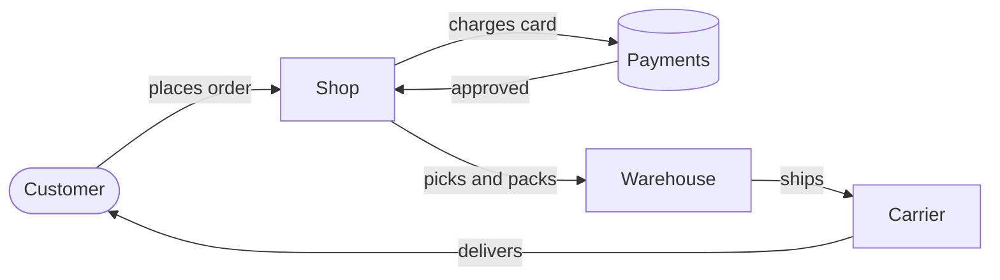

Turn this into a lesson I can step through, one chapter per stage. Save it as lesson.mmd.

```mermaid
flowchart LR
  A([Customer]) -->|places order| B[Shop]
  B -->|charges card| C[(Payments)]
  C -->|approved| B
  B -->|picks and packs| D[Warehouse]
  D -->|ships| E[Carrier]
  E -->|delivers| A
```
